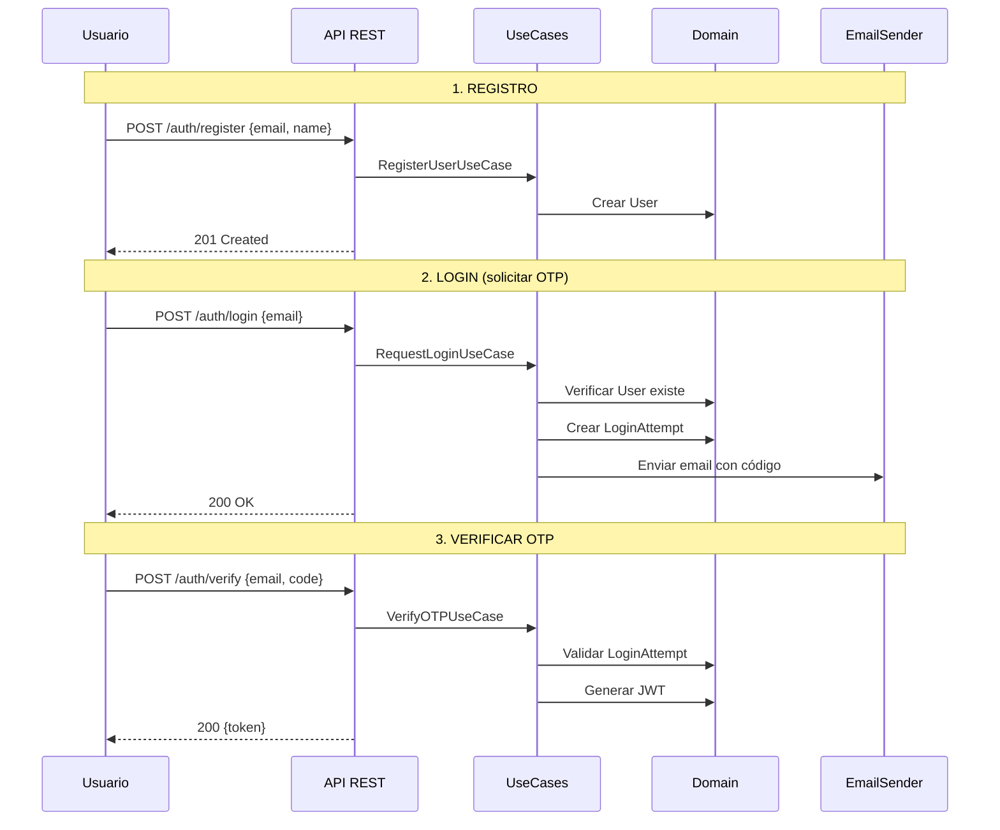

# Sistema de Login con Registro y OTP

## Flujo de Autenticación Actualizado




## Cambios Principales

### 1. User Entity (actualizar)

- Agregar `name` como campo obligatorio
- Actualizar factory methods y `toPrimitives()`

### 2. LoginAttempt Entity (nueva)

- Reemplaza el concepto de OTPRepository
- Contiene: id, email, otpCode
- Comportamiento: `isExpired()`, `verifyCode()`

### 3. Repositories

- **UserRepository**: sin cambios en interface
- **LoginAttemptRepository**: reemplaza OTPRepository
- `save(attempt)`, `findByEmail()`, `deleteByEmail()`

### 4. UseCases

- **RegisterUserUseCase** (nuevo): Crea usuario con email + nombre
- **RequestLoginUseCase**: Verifica que usuario exista, crea LoginAttempt
- **VerifyOTPUseCase**: Valida LoginAttempt y genera JWT

### 5. HTTP Endpoints

- `POST /auth/register` - Registro con email y nombre
- `POST /auth/login` - Solicita código OTP
- `POST /auth/verify` - Verifica código y retorna JWT

---

## Estructura Final

```javascript
src/auth/
├── domain/
│   ├── entities/
│   │   ├── User.ts          # email + name
│   │   └── LoginAttempt.ts  # email + otpCode
│   ├── value-objects/
│   │   ├── Email.ts         # ✅ completado
│   │   ├── OTPCode.ts       # ✅ completado
│   │   └── Token.ts         # ✅ completado
│   └── repositories/
│       ├── UserRepository.ts         # ✅ completado
│       └── LoginAttemptRepository.ts # reemplaza OTPRepository
├── application/
│   ├── RegisterUserUseCase.ts  # nuevo
│   ├── RequestLoginUseCase.ts
│   ├── VerifyOTPUseCase.ts
│   └── ports/
│       ├── EmailSender.ts      # ✅ completado
│       └── TokenGenerator.ts   # ✅ completado
├── infrastructure/
│   ├── adapters/
│   └── http/AuthController.ts
└── tests/


```