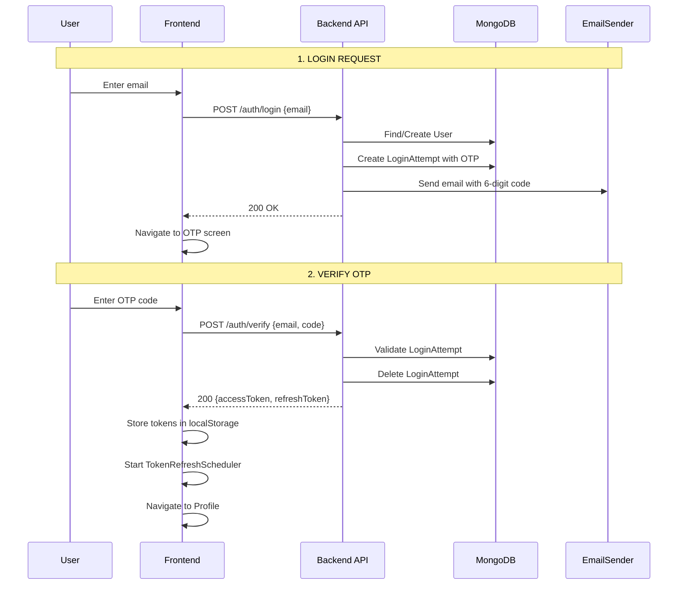
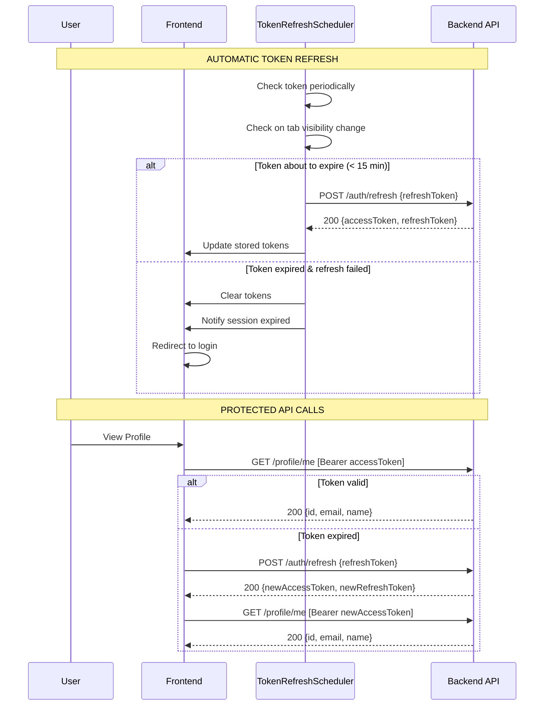
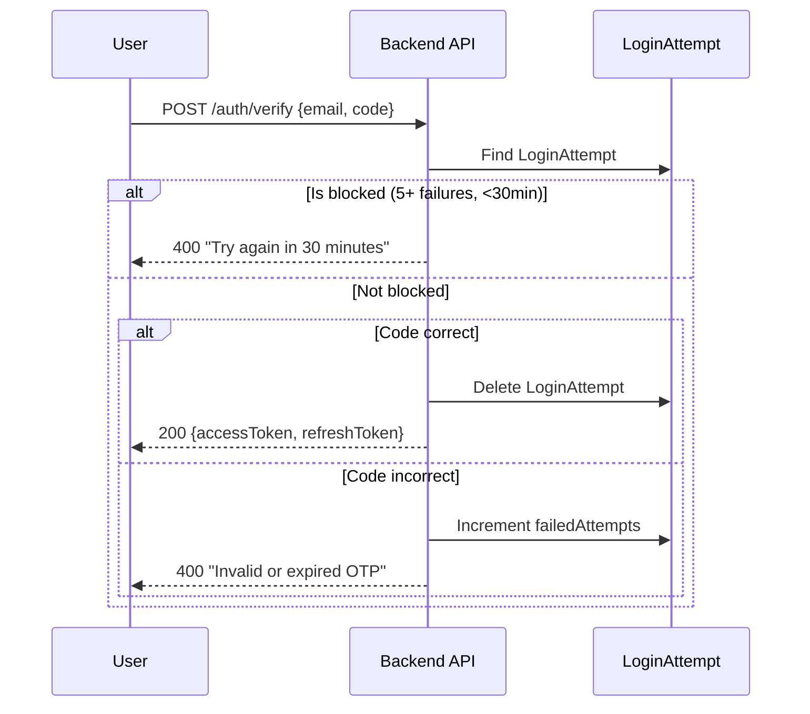
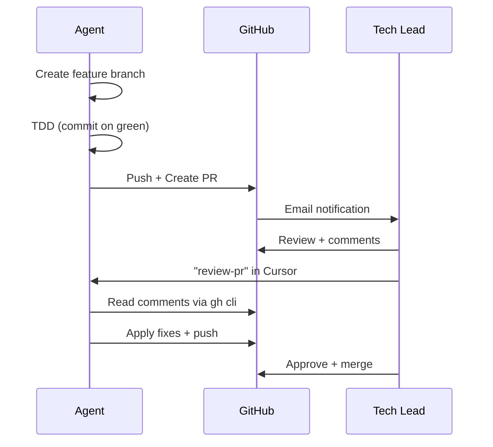

# Fullstack Template with Login OTP

[](https://nodejs.org/)
[](https://www.typescriptlang.org/)
[](https://react.dev/)
[](https://expressjs.com/)
[](https://www.mongodb.com/)
[](https://opensource.org/licenses/MIT)

Production-ready fullstack template with **email-based OTP authentication**, hexagonal architecture, and TDD practices.

## Features

- 🔐 **Passwordless authentication** with OTP codes sent via email
- 🔄 **Automatic token refresh** with JWT access/refresh tokens
- 🛡️ **Rate limiting** protection against brute force attacks
- 🏗️ **Hexagonal architecture** in both frontend and backend
- ✅ **TDD** with unit, integration, and e2e tests
- 🐳 **Docker ready** with docker-compose

---

## Quick Start

### Prerequisites

- Node.js 24+
- MongoDB 7+ (or use Docker)

### Development

```bash
# Install dependencies
npm install

# Start MongoDB (if not running)
docker run -d -p 27017:27017 mongo:7

# Configure backend
echo "MONGO_URI=mongodb://localhost:27017/app" > backend/.env
echo "JWT_SECRET=your-secret-key" >> backend/.env

# Start both frontend and backend
npm start
```

- Frontend: http://localhost:5173
- Backend: http://localhost:3000

### Docker Compose (Local)

```bash
# Configure environment
export MONGO_URI=mongodb://localhost:27017/app
export JWT_SECRET=your-secret-key

# Build and run
docker compose up --build
```

- Frontend: http://localhost:3000

### Docker Compose (Production - Dokploy)

For deployment with [Dokploy](https://dokploy.com/), use the production compose file:

```bash
# In Dokploy, configure:
# - Compose Path: docker-compose.prod.yml
# - Environment Variables: MONGO_URI, JWT_SECRET
```

The production file uses `dokploy-network` (external) to communicate with other Dokploy services like MongoDB.

---

## Authentication Flow

### Registration and OTP-based Login



### Protected Routes and Token Refresh



### Rate Limiting (Brute Force Protection)



---

## API Endpoints

| Method | Endpoint | Auth | Description |
|--------|----------|------|-------------|
| POST | `/auth/login` | No | Request OTP code sent to email |
| POST | `/auth/verify` | No | Verify OTP code and receive tokens |
| POST | `/auth/refresh` | No | Refresh access token |
| POST | `/auth/logout` | JWT | Invalidate refresh token |
| GET | `/profile/me` | JWT | Get current user profile |
| PATCH | `/profile/me` | JWT | Update user name |
| GET | `/health` | No | Health check endpoint |

### OTP Configuration

| Parameter | Value |
|-----------|-------|
| Code format | 6-digit numeric |
| Validity | 5 minutes |
| Max attempts | 5 |
| Block duration | 30 minutes |

### Token Configuration

| Parameter | Value |
|-----------|-------|
| Access token validity | 1 hour |
| Refresh token validity | 7 days |
| Auto-refresh buffer | 15 minutes before expiry |

---

## Stack

### Backend

- Node.js 24 / TypeScript 5.9
- Express 5
- MongoDB 7
- JWT (jsonwebtoken)
- Pino (structured logging)
- Jest (unit, integration, e2e)

### Frontend

- React 19
- TypeScript 5.9
- Vite 7
- React Router 7
- Jest + Testing Library (unit, integration)
- Playwright (e2e)

### Shared

- Monorepo with npm workspaces
- Common package with domain utilities (Maybe, DomainError, Subject)

---

## Architecture

Both frontend and backend follow **hexagonal architecture** with vertical slicing by business module.

```
├── backend/
│   └── src/
│       ├── auth/                    # Authentication module
│       │   ├── domain/              # Entities, Value Objects, Repositories
│       │   ├── application/         # Use Cases, Ports
│       │   ├── infrastructure/      # Adapters, HTTP Controllers
│       │   └── tests/               # Unit, Integration, E2E
│       ├── health/                  # Health check module
│       └── shared/                  # Factory, Server, Common adapters
│
├── frontend/
│   └── src/
│       ├── auth/                    # Authentication module
│       │   ├── domain/              # Entities, Value Objects
│       │   ├── application/         # Use Cases, Ports (Gateways)
│       │   ├── infrastructure/      # Adapters, UI Components
│       │   └── tests/               # Unit, Integration, E2E
│       ├── health/                  # Health check module
│       └── shared/                  # Factory, HTTP Client, UI Components
│
└── common/                          # Shared domain utilities
    └── src/
        ├── domain/                  # Maybe, DomainError, Subject
        └── infrastructure/          # API types
```

---

## Environment Variables

### Backend

| Variable | Default | Description |
|----------|---------|-------------|
| `PORT` | `3000` | Server port |
| `MONGO_URI` | - | MongoDB connection string (required) |
| `JWT_SECRET` | - | Secret key for JWT signing (required) |
| `LOG_LEVEL` | `info` | Pino log level (debug, info, warn, error, silent) |

### Frontend

| Variable | Default | Description |
|----------|---------|-------------|
| `TEST_BACKEND_URL` | `http://localhost:3001` | Backend URL for integration tests |

---

## Scripts

### Root (Monorepo)

| Command | Description |
|---------|-------------|
| `npm start` | Start both frontend and backend |
| `npm run build` | Build all workspaces |
| `npm test` | Run all tests |
| `npm run validate` | Compile and test all |

### Backend

| Command | Description |
|---------|-------------|
| `npm start` | Development server with hot reload |
| `npm test` | Run all tests |
| `npm run test:unit` | Unit tests only |
| `npm run test:integration` | Integration tests (requires MongoDB) |
| `npm run test:e2e` | E2E tests |
| `npm run build` | Build for production |

### Frontend

| Command | Description |
|---------|-------------|
| `npm start` | Development server (Vite) |
| `npm test` | Run all tests |
| `npm run test:unit` | Unit tests (Jest) |
| `npm run test:integration` | Integration tests |
| `npm run test:e2e` | E2E tests (Playwright) |
| `npm run build` | Build for production |

---

## Testing Strategy

Tests are colocated within each module:

```
module/tests/
├── unit/           # Domain + Application tests (no external deps)
├── integration/    # Adapter tests (real DB/services)
└── e2e/            # Full flow tests (HTTP/Browser)
```

### Key Principles

- **No mocks policy**: Use InMemory implementations for repositories
- **Real databases**: Integration tests use mongodb-memory-server
- **Inside-out TDD**: Start from domain, then application, then infrastructure

---

## Domain Utilities

### Maybe\<T\>

Monadic type for optional values (replaces `| undefined`):

```typescript
const user = await userRepository.findById(id);
user.fold(
  () => console.log('User not found'),
  (u) => console.log(`Found: ${u.name}`)
);
```

### DomainError

Single error class with factory methods:

```typescript
throw DomainError.createNotFound(`User ${id} not found`);
throw DomainError.createValidation('Email format is invalid');
```

### Subject\<T\>

Observable pattern for reactive state:

```typescript
const user$ = new Subject<User>();
user$.subscribe((user) => console.log(user));
user$.next(newUser);
```

---

## Development Rules

Architecture and coding standards are defined in `.cursor/rules/`. Key principles:

- Hexagonal architecture with vertical slicing
- TDD with inside-out approach
- No mocks policy in tests
- Maybe instead of `| undefined`
- DomainError with factory methods
- Pure functions and immutability preferred

---

## Git Strategy

This project uses a PR-based workflow with branch protection. An AI agent (`softwarecrafters-agent`) creates PRs that must be reviewed by the Tech Lead (`softwarecrafters-io`).

### Branch Model

```
feature branch → PR → master
```

- **master**: Protected branch, requires PR with 1 approval
- **Feature branches**: `feat/`, `fix/`, `refactor/` from master

### Commit Convention

Conventional Commits (concise) + special TDD commit:

| Type | Description |
|------|-------------|
| `feat:` | New feature |
| `fix:` | Bug fix |
| `refactor:` | Code refactoring |
| `test:` | Test changes |
| `docs:` | Documentation |
| `chore:` | Maintenance |
| `green:` | Test passes (TDD) |

**Rules**:
- Commit on every green test
- Messages in English
- Max 50 characters

### Git Hooks (Husky)

| Hook | Validations |
|------|-------------|
| `pre-commit` | lint-staged (ESLint + Prettier), TypeScript compile |
| `pre-push` | Full test suite (compile + all tests) |

**Never skip hooks** with `--no-verify`.

### GitHub Accounts Setup

Two GitHub accounts are used:

| Account | Role | Purpose |
|---------|------|---------|
| `softwarecrafters-agent` | Agent | Creates branches, commits, PRs |
| `softwarecrafters-io` | Tech Lead | Reviews, approves, merges PRs |

### Initial Setup

1. **Install GitHub CLI**:
   ```bash
   brew install gh
   ```

2. **Authenticate as agent** (use HTTPS, not SSH to avoid key conflicts):
   ```bash
   gh auth login
   # → GitHub.com → HTTPS → Login with browser
   # Login with softwarecrafters-agent account
   ```

3. **Configure git user for agent**:
   ```bash
   git config user.name "softwarecrafters-agent"
   git config user.email "agent@softwarecrafters.io"
   ```

4. **Branch protection** (already configured):
   - master requires PR with 1 approval
   - No bypass allowed

### PR Workflow



### Agent Commands

| Command | Action |
|---------|--------|
| `review-pr` | Agent reads PR comments and applies fixes |
| `review-pr #123` | Agent reviews specific PR number |

### Useful gh Commands

```bash
# Create PR with reviewer
gh pr create --base master --title "feat: description" --reviewer softwarecrafters-io

# View PR comments
gh pr view <number> --comments

# View inline code comments
gh api repos/softwarecrafters-io/elearning-core/pulls/<number>/comments
```

---

## License

MIT
