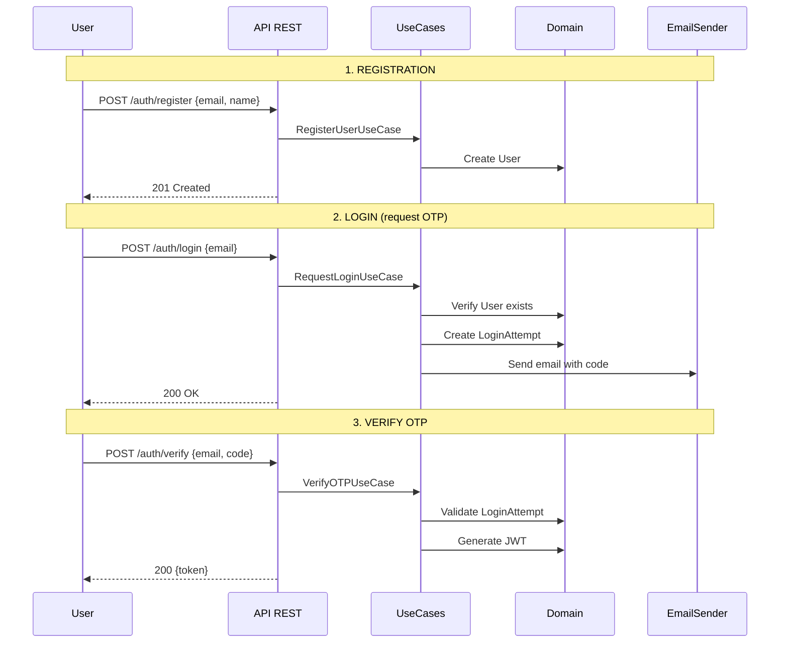
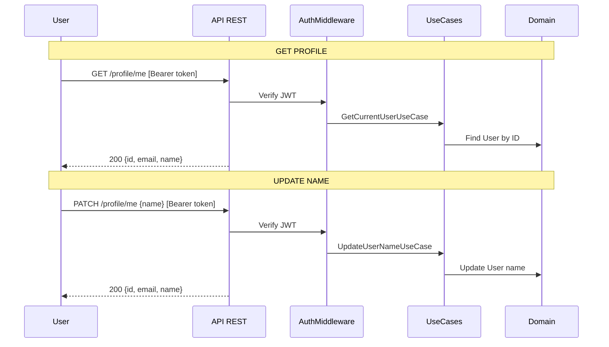

# Authentication Flow

## Registration and OTP-based Login



## Protected Endpoints



## Endpoints

| Method | Endpoint | Auth | Description |
|--------|----------|------|-------------|
| POST | `/auth/register` | No | Register new user with email and name |
| POST | `/auth/login` | No | Request OTP code sent to email |
| POST | `/auth/verify` | No | Verify OTP code and receive JWT token |
| GET | `/profile/me` | JWT | Get current user profile |
| PATCH | `/profile/me` | JWT | Update user name |

## OTP Code

- 6-digit numeric code
- Valid for 5 minutes after generation
- Single use (deleted after successful verification)

## Project Structure

```
src/auth/
├── domain/
│   ├── entities/
│   │   ├── User.ts          # email + name
│   │   └── LoginAttempt.ts  # email + otpCode + rate limiting
│   ├── value-objects/
│   │   ├── Email.ts
│   │   ├── OTPCode.ts
│   │   └── Token.ts
│   └── repositories/
│       ├── UserRepository.ts
│       └── LoginAttemptRepository.ts
├── application/
│   ├── RegisterUserUseCase.ts
│   ├── RequestLoginUseCase.ts
│   ├── VerifyOTPUseCase.ts
│   ├── GetCurrentUserUseCase.ts
│   ├── UpdateUserNameUseCase.ts
│   └── ports/
│       ├── EmailSender.ts
│       └── TokenGenerator.ts
├── infrastructure/
│   ├── adapters/
│   │   ├── MongoUserRepository.ts
│   │   ├── MongoLoginAttemptRepository.ts
│   │   ├── ConsoleEmailSender.ts
│   │   └── JWTTokenGenerator.ts
│   └── http/
│       ├── AuthController.ts
│       ├── ProfileController.ts
│       └── AuthMiddleware.ts
└── tests/
    ├── unit/
    ├── integration/
    └── e2e/
```
