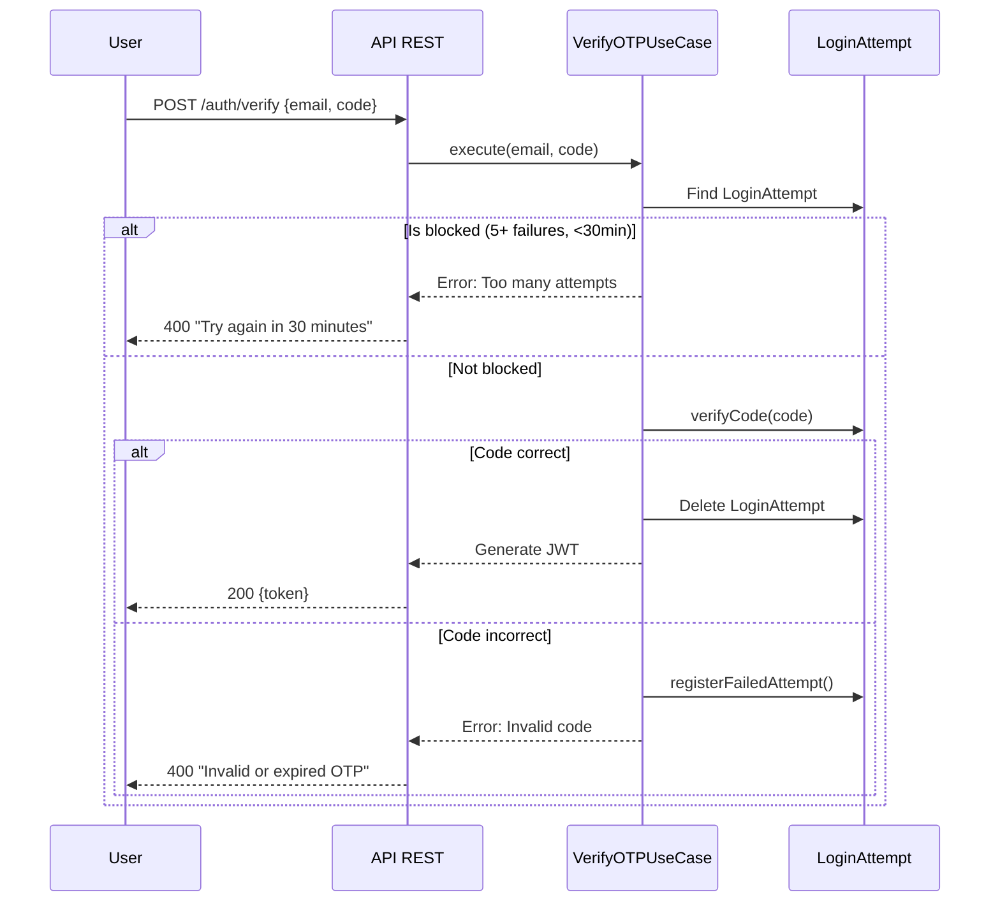
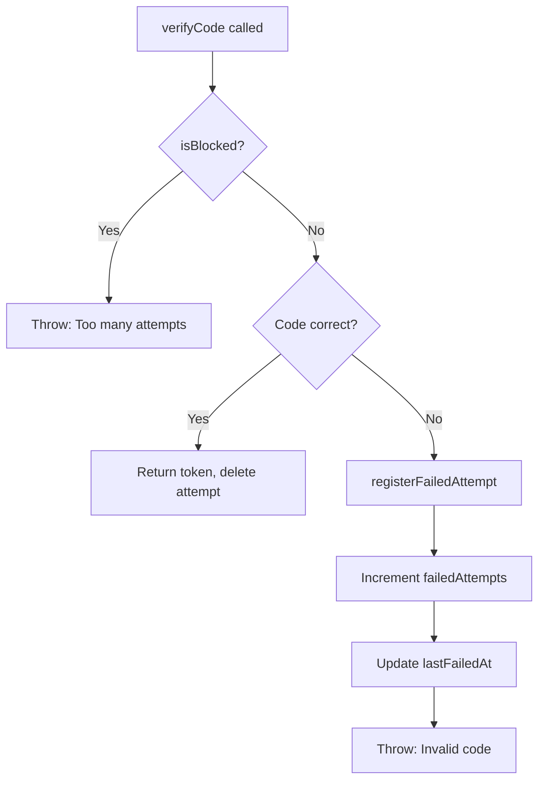
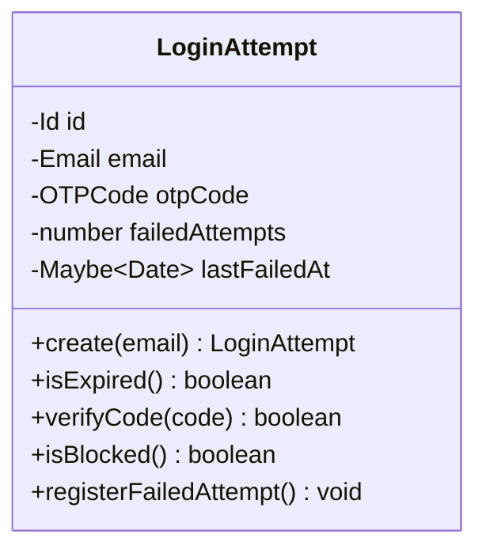

# Rate Limiting

## Brute Force Protection

The system temporarily blocks verification attempts after 5 failed OTP attempts.

## Domain Logic

## Configuration

| Parameter | Value |
|-----------|-------|
| Max attempts | 5 |
| Block duration | 30 minutes |
| Auto reset | After 30 min without attempts |

## Behavior

1. **Fresh login attempt**: User starts with 0 failed attempts
2. **Wrong OTP**: Failed attempts counter increments, timestamp recorded
3. **5 failed attempts**: User is blocked for 30 minutes
4. **After 30 minutes**: Counter resets, user can try again
5. **Correct OTP**: Login attempt deleted, token issued

## LoginAttempt Entity

