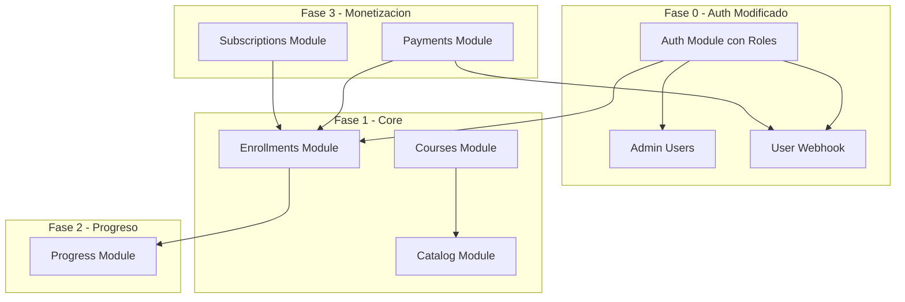
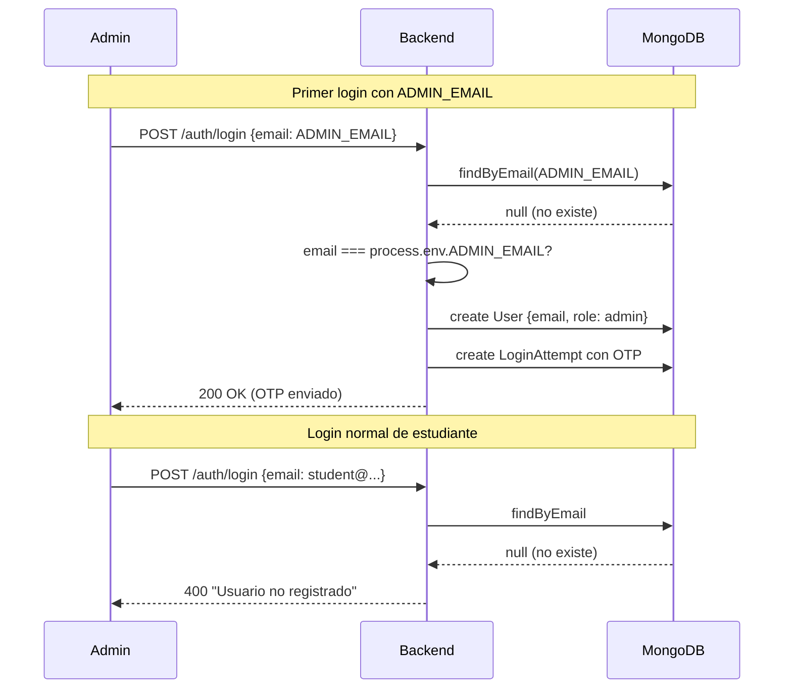
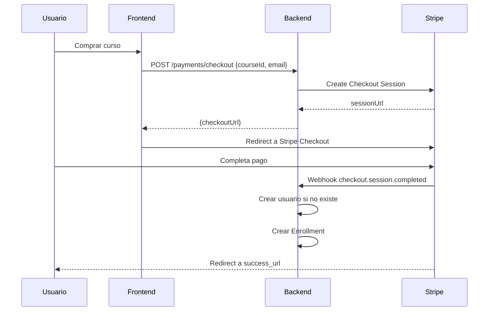
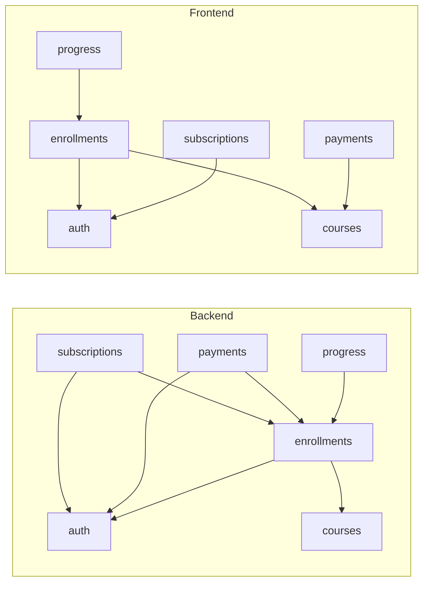

# Roadmap E-Learning Platform

## Vision del Producto

Plataforma de e-learning donde estudiantes acceden a cursos de video + texto mediante pago unico o suscripcion mensual. Los usuarios son creados exclusivamente por administradores o automaticamente al completar un pago.

### Decisiones Clave

| Aspecto | Decision |
|---------|----------|
| Contenido | Videos + texto (markdown) |
| Roles | Solo estudiantes (admin gestiona por BD) |
| Monetizacion | Pago unico por curso + Suscripcion |
| Progreso | Basico (lecciones completadas) |
| Social | Ninguna |
| Admin | Sin panel (gestion por BD) |

---

## Arquitectura de Modulos



---

## Fase 0: Modificacion Auth (Roles y Registro Controlado)

**Objetivo**: Adaptar el sistema de autenticacion para soportar roles y deshabilitar auto-registro.

### Cambios en Domain

**User Entity** - Añadir rol:

```typescript
type UserRole = 'admin' | 'student';

class User {
  // ... campos existentes
  readonly role: UserRole;
}
```

**Value Object nuevo**:

```typescript
// backend/src/auth/domain/value-objects/UserRole.ts
type UserRoleValue = 'admin' | 'student';
```

### Cambios en Application

| UseCase | Cambio |
|---------|--------|
| `RegisterUserUseCase` | Convertir en `CreateUserUseCase` - solo admins pueden ejecutarlo |
| `RequestLoginUseCase` | Verificar que usuario existe antes de enviar OTP |
| Nuevo: `CreateUserByWebhookUseCase` | Crear usuario desde webhook con secret |

**Bootstrap Admin** - En `RequestLoginUseCase`:

```typescript
// Si ADMIN_EMAIL coincide y usuario no existe -> crear con role: admin
// Si usuario no existe y NO es ADMIN_EMAIL -> error "Usuario no registrado"
```

### Cambios en Infrastructure

**Nuevos endpoints**:

| Method | Endpoint | Auth | Descripcion |
|--------|----------|------|-------------|
| POST | `/admin/users` | JWT + role:admin | Admin crea usuario |
| POST | `/webhooks/users` | X-Webhook-Secret | Crear usuario desde pago |

**AdminController**:

```typescript
// backend/src/auth/infrastructure/http/AdminController.ts
POST /admin/users
Body: { email: string, name?: string }
Response: { id, email, name, role: 'student' }
```

**WebhookController**:

```typescript
// backend/src/auth/infrastructure/http/UserWebhookController.ts
POST /webhooks/users
Header: X-Webhook-Secret: ${USER_WEBHOOK_SECRET}
Body: { email: string, name?: string }
Response: { id, email, name, role: 'student' }
```

**Middlewares nuevos**:

```typescript
// AdminMiddleware - Verifica JWT + role === 'admin'
// WebhookAuthMiddleware - Verifica X-Webhook-Secret
```

### Variables de Entorno

| Variable | Descripcion |
|----------|-------------|
| `ADMIN_EMAIL` | Email que se promueve a admin en primer login |
| `USER_WEBHOOK_SECRET` | Secret para autenticar webhook de creacion de usuarios |

### Flujo de Bootstrap Admin



### Frontend - Vistas Fase 0

| Vista | Cambios |
|-------|---------|
| `LoginPage` | Mostrar error "Usuario no registrado" si no existe |
| `ProfilePage` | Mostrar rol del usuario |

| Vista Nueva | Descripcion | Ruta |
|-------------|-------------|------|
| `AdminUsersPage` | Listar y crear usuarios (solo admin) | `/admin/users` |

---

## Fase 1: Core (MVP)

**Objetivo**: Estudiantes pueden ver catalogo, inscribirse y ver lecciones.

### Courses Module

| Capa | Componentes |
|------|-------------|
| Domain | `Course`, `Lesson`, `CourseId`, `LessonId`, `VideoUrl`, `CourseRepository` |
| Application | `GetCourseUseCase`, `GetLessonUseCase`, `ListCoursesUseCase` |
| Infrastructure | `MongoCourseRepository`, `CatalogController`, `LessonController` |

**Modelo de datos**:

```
Course: id, title, description, thumbnail, price, lessons[], published, createdAt
Lesson: id, title, description, videoUrl, content (markdown), order, duration
```

### Enrollments Module

| Capa | Componentes |
|------|-------------|
| Domain | `Enrollment`, `EnrollmentId`, `EnrollmentRepository` |
| Application | `EnrollInCourseUseCase`, `GetUserEnrollmentsUseCase`, `CheckAccessUseCase` |
| Infrastructure | `MongoEnrollmentRepository`, `EnrollmentController` |

**Modelo de datos**:

```
Enrollment: id, userId, courseId, type (free/paid/subscription), enrolledAt, expiresAt?
```

### Backend Endpoints Fase 1

| Method | Endpoint | Auth | Descripcion |
|--------|----------|------|-------------|
| GET | `/catalog/courses` | No | Listar cursos publicados |
| GET | `/catalog/courses/:id` | No | Detalle curso |
| POST | `/enrollments` | JWT | Inscribirse en curso |
| GET | `/enrollments` | JWT | Mis inscripciones |
| GET | `/courses/:id/lessons/:lessonId` | JWT + enrolled | Ver leccion |

### Frontend - Vistas Fase 1

| Vista | Descripcion | Ruta |
|-------|-------------|------|
| `CatalogPage` | Grid de cursos disponibles | `/courses` |
| `CourseDetailPage` | Info curso + lista lecciones + CTA inscribirse | `/courses/:id` |
| `LessonPage` | Video player + contenido markdown + sidebar | `/courses/:courseId/lessons/:lessonId` |
| `MyCoursesPage` | Cursos en los que estoy inscrito | `/my-courses` |

**Wireframes**:

```
┌─────────────────────────────────────┐
│  CATALOGO                           │
├─────────────────────────────────────┤
│  ┌─────┐  ┌─────┐  ┌─────┐         │
│  │     │  │     │  │     │         │
│  │Curso│  │Curso│  │Curso│         │
│  │ $49 │  │ $29 │  │ $99 │         │
│  └─────┘  └─────┘  └─────┘         │
└─────────────────────────────────────┘

┌─────────────────────────────────────┐
│  DETALLE CURSO                      │
├─────────────────────────────────────┤
│  ┌──────────────────┐  Titulo       │
│  │    Thumbnail     │  Descripcion  │
│  │                  │  Precio: $49  │
│  └──────────────────┘  [Inscribirse]│
│                                     │
│  Lecciones:                         │
│  1. Introduccion          15 min    │
│  2. Fundamentos           30 min    │
│  3. Practica              45 min    │
└─────────────────────────────────────┘

┌─────────────────────────────────────┐
│  LECCION                            │
├──────────────────┬──────────────────┤
│                  │ Lecciones:       │
│   ┌──────────┐   │ * 1. Intro      │
│   │  VIDEO   │   │ > 2. Fundament. │
│   │  PLAYER  │   │   3. Practica   │
│   └──────────┘   │                  │
│                  │                  │
│  ## Contenido    │                  │
│  Texto markdown  │                  │
│  de la leccion   │                  │
└──────────────────┴──────────────────┘
```

---

## Fase 2: Progreso

**Objetivo**: Estudiantes trackean su avance en los cursos.

### Progress Module

| Capa | Componentes |
|------|-------------|
| Domain | `LessonProgress`, `ProgressRepository` |
| Application | `MarkLessonCompletedUseCase`, `GetCourseProgressUseCase`, `GetDashboardUseCase` |
| Infrastructure | `MongoProgressRepository`, `ProgressController` |

**Modelo de datos**:

```
LessonProgress: userId, lessonId, courseId, completedAt
```

### Backend Endpoints Fase 2

| Method | Endpoint | Auth | Descripcion |
|--------|----------|------|-------------|
| POST | `/progress/lessons/:id/complete` | JWT | Marcar completada |
| GET | `/progress/courses/:id` | JWT | Progreso en curso |
| GET | `/progress/dashboard` | JWT | Resumen todos mis cursos |

### Frontend - Vistas Fase 2

| Vista | Descripcion | Ruta |
|-------|-------------|------|
| `DashboardPage` | Resumen de progreso en todos mis cursos | `/dashboard` |

**Modificaciones a vistas existentes**:

| Vista | Cambio |
|-------|--------|
| `LessonPage` | Boton "Marcar como completada" + checkmarks en sidebar |
| `MyCoursesPage` | Mostrar % progreso en cada curso |

**Wireframe Dashboard**:

```
┌─────────────────────────────────────┐
│  DASHBOARD                          │
├─────────────────────────────────────┤
│  Bienvenido, Juan                   │
│                                     │
│  Continuar aprendiendo:             │
│  ┌─────────────────────────────┐    │
│  │ Curso React     ████████░░ 80%   │
│  │ Ultima: Leccion 4    [Continuar] │
│  └─────────────────────────────┘    │
│  ┌─────────────────────────────┐    │
│  │ Curso Node      ███░░░░░░░ 30%   │
│  │ Ultima: Leccion 2    [Continuar] │
│  └─────────────────────────────┘    │
└─────────────────────────────────────┘
```

---

## Fase 3: Monetizacion

**Objetivo**: Compra de cursos y suscripciones con Stripe.

### Payments Module

| Capa | Componentes |
|------|-------------|
| Domain | `Payment`, `PaymentId`, `PaymentStatus` |
| Application | `CreateCheckoutUseCase`, `HandlePaymentWebhookUseCase`, `PaymentGateway` (port) |
| Infrastructure | `StripePaymentGateway`, `PaymentController`, `StripeWebhookController` |

### Subscriptions Module

| Capa | Componentes |
|------|-------------|
| Domain | `Subscription`, `SubscriptionPlan`, `SubscriptionStatus` |
| Application | `CreateSubscriptionUseCase`, `CancelSubscriptionUseCase`, `CheckSubscriptionUseCase` |
| Infrastructure | `MongoSubscriptionRepository`, `SubscriptionController` |

**Modelo de datos**:

```
Subscription: id, userId, planId, status, currentPeriodStart, currentPeriodEnd, stripeSubscriptionId
SubscriptionPlan: id, name, price, interval (monthly/yearly)
```

### Flujo de Compra



### Backend Endpoints Fase 3

| Method | Endpoint | Auth | Descripcion |
|--------|----------|------|-------------|
| POST | `/payments/checkout` | No* | Crear checkout Stripe |
| POST | `/payments/webhook` | Stripe-Signature | Webhook Stripe |
| GET | `/subscriptions/plans` | No | Listar planes |
| POST | `/subscriptions/checkout` | No* | Checkout suscripcion |
| DELETE | `/subscriptions` | JWT | Cancelar |
| GET | `/subscriptions/status` | JWT | Mi estado |

*El checkout puede ser sin auth si el usuario no existe aun

### Frontend - Vistas Fase 3

| Vista | Descripcion | Ruta |
|-------|-------------|------|
| `PricingPage` | Planes de suscripcion | `/pricing` |
| `CheckoutSuccessPage` | Confirmacion de compra | `/checkout/success` |
| `CheckoutCancelPage` | Compra cancelada | `/checkout/cancel` |
| `SubscriptionPage` | Gestionar mi suscripcion | `/subscription` |

**Modificaciones a vistas existentes**:

| Vista | Cambio |
|-------|--------|
| `CourseDetailPage` | Boton "Comprar" que redirige a Stripe |
| `ProfilePage` | Mostrar estado suscripcion |

**Wireframes Fase 3**:

```
┌─────────────────────────────────────┐
│  PRICING                            │
├─────────────────────────────────────┤
│         Elige tu plan               │
│                                     │
│  ┌───────────┐    ┌───────────┐    │
│  │  MENSUAL  │    │   ANUAL   │    │
│  │           │    │           │    │
│  │  $19/mes  │    │  $149/año │    │
│  │           │    │  Ahorra 35%    │
│  │ - Acceso  │    │ - Acceso  │    │
│  │   total   │    │   total   │    │
│  │           │    │           │    │
│  │[Suscribir]│    │[Suscribir]│    │
│  └───────────┘    └───────────┘    │
│                                     │
│  O compra cursos individuales       │
└─────────────────────────────────────┘

┌─────────────────────────────────────┐
│  MI SUSCRIPCION                     │
├─────────────────────────────────────┤
│  Plan: Mensual                      │
│  Estado: Activa                     │
│  Proxima facturacion: 15 Feb 2026   │
│                                     │
│  [Cancelar suscripcion]             │
└─────────────────────────────────────┘
```

---

## Vertical Slicing - Estructura de Modulos

### Backend - Estructura Completa

```
backend/src/
├── auth/                           # [EXISTENTE - MODIFICAR]
│   ├── domain/
│   │   ├── entities/
│   │   │   ├── User.ts             # Añadir role: admin | student
│   │   │   ├── LoginAttempt.ts
│   │   │   └── Session.ts
│   │   ├── value-objects/
│   │   │   ├── Email.ts
│   │   │   ├── OTPCode.ts
│   │   │   ├── RefreshToken.ts
│   │   │   ├── Token.ts
│   │   │   └── UserRole.ts         # NUEVO
│   │   └── repositories/
│   │       ├── UserRepository.ts
│   │       ├── LoginAttemptRepository.ts
│   │       └── SessionRepository.ts
│   ├── application/
│   │   ├── CreateUserUseCase.ts    # NUEVO (antes RegisterUserUseCase)
│   │   ├── CreateUserByWebhookUseCase.ts  # NUEVO
│   │   ├── RequestLoginUseCase.ts  # MODIFICAR (validar usuario existe)
│   │   ├── VerifyOTPUseCase.ts
│   │   ├── GetCurrentUserUseCase.ts
│   │   ├── UpdateUserNameUseCase.ts
│   │   ├── RefreshTokenUseCase.ts
│   │   ├── LogoutUseCase.ts
│   │   └── ports/
│   │       └── ...
│   ├── infrastructure/
│   │   ├── adapters/
│   │   │   └── ...
│   │   └── http/
│   │       ├── AuthController.ts
│   │       ├── AuthMiddleware.ts
│   │       ├── AdminMiddleware.ts      # NUEVO
│   │       ├── WebhookAuthMiddleware.ts # NUEVO
│   │       ├── AdminController.ts      # NUEVO
│   │       ├── UserWebhookController.ts # NUEVO
│   │       ├── ProfileController.ts
│   │       └── SessionController.ts
│   └── tests/
│       ├── unit/
│       ├── integration/
│       └── e2e/
│
├── courses/                        # NUEVO - Fase 1
│   ├── domain/
│   │   ├── entities/
│   │   │   ├── Course.ts
│   │   │   └── Lesson.ts
│   │   ├── value-objects/
│   │   │   ├── CourseId.ts
│   │   │   ├── LessonId.ts
│   │   │   ├── VideoUrl.ts
│   │   │   └── Price.ts
│   │   └── repositories/
│   │       └── CourseRepository.ts     # Interface + InMemory
│   ├── application/
│   │   ├── GetCourseUseCase.ts
│   │   ├── GetLessonUseCase.ts
│   │   ├── ListCoursesUseCase.ts
│   │   └── CourseDTO.ts
│   ├── infrastructure/
│   │   ├── adapters/
│   │   │   └── MongoCourseRepository.ts
│   │   └── http/
│   │       ├── CatalogController.ts
│   │       └── LessonController.ts
│   └── tests/
│       ├── unit/
│       │   ├── domain/
│       │   │   ├── Course.test.ts
│       │   │   ├── Lesson.test.ts
│       │   │   └── value-objects/
│       │   └── application/
│       │       ├── GetCourseUseCase.test.ts
│       │       └── ListCoursesUseCase.test.ts
│       ├── integration/
│       │   └── MongoCourseRepository.integration.test.ts
│       └── e2e/
│           └── CatalogController.e2e.test.ts
│
├── enrollments/                    # NUEVO - Fase 1
│   ├── domain/
│   │   ├── entities/
│   │   │   └── Enrollment.ts
│   │   ├── value-objects/
│   │   │   ├── EnrollmentId.ts
│   │   │   └── EnrollmentType.ts   # free | paid | subscription
│   │   └── repositories/
│   │       └── EnrollmentRepository.ts
│   ├── application/
│   │   ├── EnrollInCourseUseCase.ts
│   │   ├── GetUserEnrollmentsUseCase.ts
│   │   ├── CheckAccessUseCase.ts
│   │   └── EnrollmentDTO.ts
│   ├── infrastructure/
│   │   ├── adapters/
│   │   │   └── MongoEnrollmentRepository.ts
│   │   └── http/
│   │       ├── EnrollmentController.ts
│   │       └── EnrollmentMiddleware.ts  # Verificar acceso a leccion
│   └── tests/
│       └── ...
│
├── progress/                       # NUEVO - Fase 2
│   ├── domain/
│   │   ├── entities/
│   │   │   └── LessonProgress.ts
│   │   └── repositories/
│   │       └── ProgressRepository.ts
│   ├── application/
│   │   ├── MarkLessonCompletedUseCase.ts
│   │   ├── GetCourseProgressUseCase.ts
│   │   ├── GetDashboardUseCase.ts
│   │   └── ProgressDTO.ts
│   ├── infrastructure/
│   │   ├── adapters/
│   │   │   └── MongoProgressRepository.ts
│   │   └── http/
│   │       └── ProgressController.ts
│   └── tests/
│       └── ...
│
├── payments/                       # NUEVO - Fase 3
│   ├── domain/
│   │   ├── entities/
│   │   │   └── Payment.ts
│   │   ├── value-objects/
│   │   │   ├── PaymentId.ts
│   │   │   └── PaymentStatus.ts
│   │   └── repositories/
│   │       └── PaymentRepository.ts
│   ├── application/
│   │   ├── CreateCheckoutUseCase.ts
│   │   ├── HandlePaymentWebhookUseCase.ts
│   │   ├── ports/
│   │   │   └── PaymentGateway.ts       # Interface para Stripe
│   │   └── PaymentDTO.ts
│   ├── infrastructure/
│   │   ├── adapters/
│   │   │   ├── StripePaymentGateway.ts
│   │   │   └── MongoPaymentRepository.ts
│   │   └── http/
│   │       ├── PaymentController.ts
│   │       └── StripeWebhookController.ts
│   └── tests/
│       └── ...
│
├── subscriptions/                  # NUEVO - Fase 3
│   ├── domain/
│   │   ├── entities/
│   │   │   ├── Subscription.ts
│   │   │   └── SubscriptionPlan.ts
│   │   ├── value-objects/
│   │   │   └── SubscriptionStatus.ts
│   │   └── repositories/
│   │       └── SubscriptionRepository.ts
│   ├── application/
│   │   ├── CreateSubscriptionUseCase.ts
│   │   ├── CancelSubscriptionUseCase.ts
│   │   ├── CheckSubscriptionUseCase.ts
│   │   └── SubscriptionDTO.ts
│   ├── infrastructure/
│   │   ├── adapters/
│   │   │   └── MongoSubscriptionRepository.ts
│   │   └── http/
│   │       └── SubscriptionController.ts
│   └── tests/
│       └── ...
│
├── health/                         # [EXISTENTE]
│   └── ...
│
├── shared/                         # [EXISTENTE]
│   ├── domain/
│   │   └── value-objects/
│   │       └── Id.ts
│   ├── application/
│   │   └── ports/
│   │       └── Logger.ts
│   └── infrastructure/
│       ├── factory.ts              # MODIFICAR - añadir nuevos modulos
│       ├── server.ts
│       ├── http/
│       │   └── handleError.ts
│       └── adapters/
│           └── PinoLogger.ts
│
└── main.ts
```

### Frontend - Estructura Completa

```
frontend/src/
├── auth/                           # [EXISTENTE - MODIFICAR]
│   ├── domain/
│   │   ├── entities/
│   │   │   └── User.ts             # Añadir role
│   │   ├── value-objects/
│   │   │   ├── AccessToken.ts
│   │   │   └── Token.ts
│   │   └── repositories/
│   │       └── ProfileRepository.ts
│   ├── application/
│   │   ├── GetProfileUseCase.ts
│   │   ├── LoginUseCase.ts
│   │   ├── LogoutUseCase.ts
│   │   ├── VerifyOTPUseCase.ts
│   │   ├── RefreshTokenUseCase.ts
│   │   ├── UpdateProfileUseCase.ts
│   │   ├── CreateUserUseCase.ts    # NUEVO (admin)
│   │   ├── ListUsersUseCase.ts     # NUEVO (admin)
│   │   ├── AuthDTO.ts
│   │   └── ports/
│   │       ├── AuthGateway.ts
│   │       ├── SessionGateway.ts
│   │       ├── TokenStorage.ts
│   │       └── AdminGateway.ts     # NUEVO
│   ├── infrastructure/
│   │   ├── adapters/
│   │   │   ├── HttpAuthGateway.ts
│   │   │   ├── HttpProfileRepository.ts
│   │   │   ├── HttpSessionGateway.ts
│   │   │   ├── LocalStorageTokenStorage.ts
│   │   │   └── HttpAdminGateway.ts     # NUEVO
│   │   ├── services/
│   │   │   └── TokenRefreshScheduler.ts
│   │   └── ui/
│   │       ├── Login/
│   │       │   ├── Login.hook.ts
│   │       │   ├── Login.module.css
│   │       │   ├── Login.page.tsx
│   │       │   └── Login.tsx
│   │       ├── VerifyOTP/
│   │       │   └── ...
│   │       ├── Profile/
│   │       │   └── ...
│   │       ├── AdminUsers/             # NUEVO
│   │       │   ├── AdminUsers.hook.ts
│   │       │   ├── AdminUsers.module.css
│   │       │   ├── AdminUsers.page.tsx
│   │       │   └── AdminUsers.tsx
│   │       ├── AdminRoute.tsx          # NUEVO (HOC para rutas admin)
│   │       └── ProtectedRoute.tsx
│   └── tests/
│       └── ...
│
├── courses/                        # NUEVO - Fase 1
│   ├── domain/
│   │   ├── entities/
│   │   │   ├── Course.ts
│   │   │   └── Lesson.ts
│   │   ├── value-objects/
│   │   │   ├── CourseId.ts
│   │   │   └── LessonId.ts
│   │   └── repositories/
│   │       └── CourseRepository.ts
│   ├── application/
│   │   ├── GetCourseUseCase.ts
│   │   ├── GetLessonUseCase.ts
│   │   ├── ListCoursesUseCase.ts
│   │   ├── CourseDTO.ts
│   │   └── ports/
│   │       └── CourseGateway.ts
│   ├── infrastructure/
│   │   ├── adapters/
│   │   │   └── HttpCourseGateway.ts
│   │   └── ui/
│   │       ├── Catalog/
│   │       │   ├── Catalog.hook.ts
│   │       │   ├── Catalog.module.css
│   │       │   ├── Catalog.page.tsx
│   │       │   └── Catalog.tsx
│   │       ├── CourseDetail/
│   │       │   ├── CourseDetail.hook.ts
│   │       │   ├── CourseDetail.module.css
│   │       │   ├── CourseDetail.page.tsx
│   │       │   └── CourseDetail.tsx
│   │       ├── Lesson/
│   │       │   ├── Lesson.hook.ts
│   │       │   ├── Lesson.module.css
│   │       │   ├── Lesson.page.tsx
│   │       │   └── Lesson.tsx
│   │       ├── MyCourses/
│   │       │   ├── MyCourses.hook.ts
│   │       │   ├── MyCourses.module.css
│   │       │   ├── MyCourses.page.tsx
│   │       │   └── MyCourses.tsx
│   │       └── components/
│   │           ├── CourseCard.tsx
│   │           ├── CourseCard.module.css
│   │           ├── LessonList.tsx
│   │           ├── VideoPlayer.tsx
│   │           └── MarkdownContent.tsx
│   └── tests/
│       ├── unit/
│       │   ├── domain/
│       │   │   └── Course.test.ts
│       │   ├── application/
│       │   │   └── ListCoursesUseCase.test.ts
│       │   └── infrastructure/
│       │       └── ui/
│       │           └── Catalog.hook.test.ts
│       └── integration/
│           └── HttpCourseGateway.integration.test.ts
│
├── enrollments/                    # NUEVO - Fase 1
│   ├── domain/
│   │   ├── entities/
│   │   │   └── Enrollment.ts
│   │   └── repositories/
│   │       └── EnrollmentRepository.ts
│   ├── application/
│   │   ├── EnrollInCourseUseCase.ts
│   │   ├── GetEnrollmentsUseCase.ts
│   │   ├── CheckAccessUseCase.ts
│   │   ├── EnrollmentDTO.ts
│   │   └── ports/
│   │       └── EnrollmentGateway.ts
│   ├── infrastructure/
│   │   ├── adapters/
│   │   │   └── HttpEnrollmentGateway.ts
│   │   └── ui/
│   │       └── components/
│   │           └── EnrollButton.tsx
│   └── tests/
│       └── ...
│
├── progress/                       # NUEVO - Fase 2
│   ├── domain/
│   │   ├── entities/
│   │   │   └── CourseProgress.ts
│   │   └── repositories/
│   │       └── ProgressRepository.ts
│   ├── application/
│   │   ├── MarkLessonCompletedUseCase.ts
│   │   ├── GetCourseProgressUseCase.ts
│   │   ├── GetDashboardUseCase.ts
│   │   ├── ProgressDTO.ts
│   │   └── ports/
│   │       └── ProgressGateway.ts
│   ├── infrastructure/
│   │   ├── adapters/
│   │   │   └── HttpProgressGateway.ts
│   │   └── ui/
│   │       ├── Dashboard/
│   │       │   ├── Dashboard.hook.ts
│   │       │   ├── Dashboard.module.css
│   │       │   ├── Dashboard.page.tsx
│   │       │   └── Dashboard.tsx
│   │       └── components/
│   │           ├── ProgressBar.tsx
│   │           ├── ProgressBar.module.css
│   │           ├── CourseProgressCard.tsx
│   │           └── LessonCheckmark.tsx
│   └── tests/
│       └── ...
│
├── payments/                       # NUEVO - Fase 3
│   ├── domain/
│   │   └── entities/
│   │       └── Payment.ts
│   ├── application/
│   │   ├── CreateCheckoutUseCase.ts
│   │   ├── PaymentDTO.ts
│   │   └── ports/
│   │       └── PaymentGateway.ts
│   ├── infrastructure/
│   │   ├── adapters/
│   │   │   └── HttpPaymentGateway.ts
│   │   └── ui/
│   │       ├── Checkout/
│   │       │   ├── CheckoutSuccess.page.tsx
│   │       │   └── CheckoutCancel.page.tsx
│   │       └── components/
│   │           └── BuyButton.tsx
│   └── tests/
│       └── ...
│
├── subscriptions/                  # NUEVO - Fase 3
│   ├── domain/
│   │   └── entities/
│   │       └── Subscription.ts
│   ├── application/
│   │   ├── GetSubscriptionUseCase.ts
│   │   ├── CancelSubscriptionUseCase.ts
│   │   ├── SubscriptionDTO.ts
│   │   └── ports/
│   │       └── SubscriptionGateway.ts
│   ├── infrastructure/
│   │   ├── adapters/
│   │   │   └── HttpSubscriptionGateway.ts
│   │   └── ui/
│   │       ├── Pricing/
│   │       │   ├── Pricing.hook.ts
│   │       │   ├── Pricing.module.css
│   │       │   ├── Pricing.page.tsx
│   │       │   └── Pricing.tsx
│   │       ├── Subscription/
│   │       │   ├── Subscription.hook.ts
│   │       │   ├── Subscription.module.css
│   │       │   ├── Subscription.page.tsx
│   │       │   └── Subscription.tsx
│   │       └── components/
│   │           ├── PricingCard.tsx
│   │           └── SubscriptionBadge.tsx
│   └── tests/
│       └── ...
│
├── health/                         # [EXISTENTE]
│   └── ...
│
├── shared/                         # [EXISTENTE - MODIFICAR]
│   ├── infrastructure/
│   │   ├── factory.ts              # Añadir nuevos modulos
│   │   ├── http/
│   │   │   ├── HttpClient.ts
│   │   │   └── AuthenticatedHttpClient.ts
│   │   └── ui/
│   │       ├── App/
│   │       │   ├── App.tsx         # Añadir nuevas rutas
│   │       │   └── App.css
│   │       ├── routes.ts           # Definir todas las rutas
│   │       ├── Layout/             # NUEVO
│   │       │   ├── Layout.tsx
│   │       │   ├── Layout.module.css
│   │       │   ├── Navbar.tsx
│   │       │   └── Sidebar.tsx
│   │       ├── Home/
│   │       │   └── ...
│   │       └── ProtectedRoute/
│   │           └── ProtectedRoute.tsx
│   └── tests/
│       └── ...
│
└── main.tsx
```

---

## Patron de UI por Vista

Cada vista sigue el mismo patron:

```
NombreVista/
├── NombreVista.hook.ts      # Custom hook con logica (usa UseCases)
├── NombreVista.module.css   # Estilos CSS Modules
├── NombreVista.page.tsx     # Componente Page (conecta hook + componente)
└── NombreVista.tsx          # Componente presentacional puro
```

**Ejemplo de flujo**:

```typescript
// Catalog.hook.ts
export function useCatalog() {
  const [courses, setCourses] = useState<CourseDTO[]>([]);
  const [loading, setLoading] = useState(true);
  
  useEffect(() => {
    const useCase = factory.createListCoursesUseCase();
    useCase.execute().then(setCourses).finally(() => setLoading(false));
  }, []);
  
  return { courses, loading };
}

// Catalog.page.tsx
export function CatalogPage() {
  const { courses, loading } = useCatalog();
  return <Catalog courses={courses} loading={loading} />;
}

// Catalog.tsx (presentacional)
interface CatalogProps {
  courses: CourseDTO[];
  loading: boolean;
}
export function Catalog({ courses, loading }: CatalogProps) {
  if (loading) return <Spinner />;
  return (
    <div className={styles.grid}>
      {courses.map(course => <CourseCard key={course.id} course={course} />)}
    </div>
  );
}
```

---

## Rutas del Frontend

```typescript
// shared/infrastructure/ui/routes.ts
export const routes = {
  // Publicas
  home: '/',
  login: '/login',
  verifyOtp: '/verify-otp',
  catalog: '/courses',
  courseDetail: '/courses/:id',
  pricing: '/pricing',
  checkoutSuccess: '/checkout/success',
  checkoutCancel: '/checkout/cancel',
  
  // Protegidas (requieren auth)
  dashboard: '/dashboard',
  myCourses: '/my-courses',
  lesson: '/courses/:courseId/lessons/:lessonId',
  profile: '/profile',
  subscription: '/subscription',
  
  // Admin (requieren role: admin)
  adminUsers: '/admin/users',
};
```

---

## Navegacion Global

```
┌─────────────────────────────────────────────────┐
│  Logo    Cursos  Pricing  [Mi cuenta v]         │
│                           - Dashboard           │
│                           - Mis cursos          │
│                           - Suscripcion         │
│                           - Perfil              │
│                           - Admin (si admin)    │
│                           - Cerrar sesion       │
└─────────────────────────────────────────────────┘
```

---

## Dependencias entre Modulos



**Regla**: Un modulo puede importar entidades/VOs de otro modulo, pero NUNCA UseCases.

---

## Variables de Entorno

### Backend

| Variable | Descripcion |
|----------|-------------|
| `MONGO_URI` | Conexion MongoDB |
| `JWT_SECRET` | Secret para JWT |
| `ADMIN_EMAIL` | Email bootstrap admin |
| `USER_WEBHOOK_SECRET` | Secret webhook usuarios |
| `STRIPE_SECRET_KEY` | API key Stripe |
| `STRIPE_WEBHOOK_SECRET` | Secret webhooks Stripe |

### Frontend

| Variable | Descripcion |
|----------|-------------|
| `VITE_API_URL` | URL del backend |
| `VITE_STRIPE_PUBLIC_KEY` | Public key Stripe |

---

## Endpoints API Completos

### Auth (Fase 0)

| Method | Endpoint | Auth | Descripcion |
|--------|----------|------|-------------|
| POST | `/auth/login` | No | Solicitar OTP (usuario debe existir) |
| POST | `/auth/verify` | No | Verificar OTP |
| POST | `/auth/refresh` | No | Refrescar token |
| POST | `/auth/logout` | JWT | Cerrar sesion |
| POST | `/admin/users` | JWT + admin | Crear usuario |
| POST | `/webhooks/users` | X-Webhook-Secret | Crear usuario (integracion) |
| GET | `/profile/me` | JWT | Perfil actual |
| PATCH | `/profile/me` | JWT | Actualizar nombre |

### Catalog y Cursos (Fase 1)

| Method | Endpoint | Auth | Descripcion |
|--------|----------|------|-------------|
| GET | `/catalog/courses` | No | Listar cursos |
| GET | `/catalog/courses/:id` | No | Detalle curso |
| GET | `/courses/:id/lessons/:lessonId` | JWT + enrolled | Ver leccion |
| POST | `/enrollments` | JWT | Inscribirse |
| GET | `/enrollments` | JWT | Mis inscripciones |

### Progreso (Fase 2)

| Method | Endpoint | Auth | Descripcion |
|--------|----------|------|-------------|
| POST | `/progress/lessons/:id/complete` | JWT | Completar leccion |
| GET | `/progress/courses/:id` | JWT | Progreso en curso |
| GET | `/progress/dashboard` | JWT | Dashboard |

### Pagos y Suscripciones (Fase 3)

| Method | Endpoint | Auth | Descripcion |
|--------|----------|------|-------------|
| POST | `/payments/checkout` | No | Crear checkout Stripe |
| POST | `/payments/webhook` | Stripe-Signature | Webhook Stripe |
| GET | `/subscriptions/plans` | No | Listar planes |
| POST | `/subscriptions/checkout` | No | Checkout suscripcion |
| DELETE | `/subscriptions` | JWT | Cancelar |
| GET | `/subscriptions/status` | JWT | Estado |

---

## Stack Tecnologico

### Backend
- Node.js 24 / TypeScript 5.9
- Express 5
- MongoDB 7
- JWT (jsonwebtoken)
- Stripe SDK

### Frontend
- React 19 / TypeScript 5.9
- Vite 7
- React Router 7
- Stripe.js

### Testing
- Jest (unit, integration)
- Playwright (e2e)
- mongodb-memory-server

---

## Orden de Implementacion

1. **Fase 0**: Modificar Auth (roles, registro controlado)
2. **Fase 1**: Courses + Enrollments (MVP funcional)
3. **Fase 2**: Progress (tracking de avance)
4. **Fase 3**: Payments + Subscriptions (monetizacion)

Cada fase se desarrolla con TDD inside-out siguiendo las reglas del proyecto.

